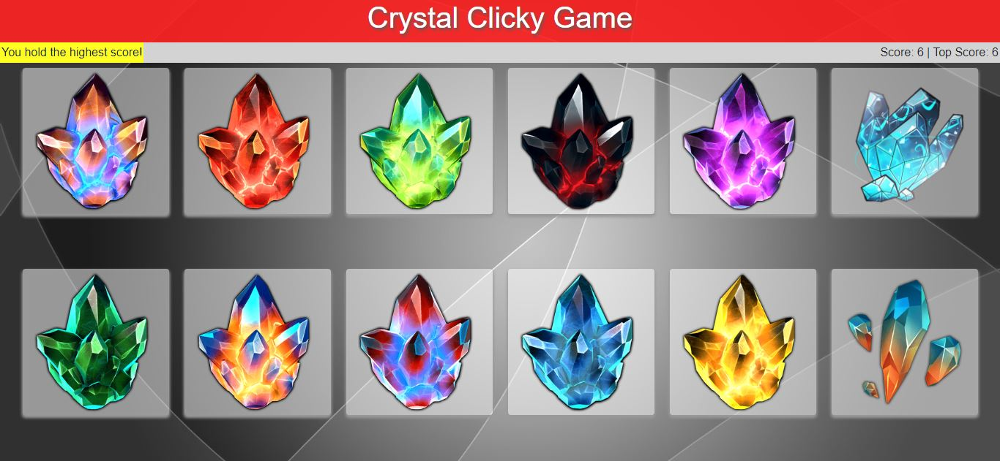

# React Crystals Clicky Game

### [View the app here](https://mvang92.github.io/clickylive/)

## Program Description
In this memory-based React application, it utilized React components, state management, and the ability to respond to user events. The score to beat is 12, but the player may not click on the same image twice a round. The application also keeps track of the highest score and also the current score. Clicking on an image will increment the current score by one and randomize the images. Clicking on the same image will reset the score to 0 and restarts the game. The high score will also be updated to show the highest score the player has reached.

## Screenshots

Upon start, the scores are set to 0, and the player may choose to click any image they want.

Once the player clicks on the same image twice in the same round, the score is reset to 0. A yellow game status message also displays towards the left to notify the player what the status of the game is.

When the player scores higher than the high score, the high score counter increments with the current score and keeps track of the highest score. The game status message also indicates

* Of course, the appearance and functionality of the app may change, so these images may not be entirely accurate.

## Technologies Used
* ReactJS
* NodeJS
* Bootstrap
